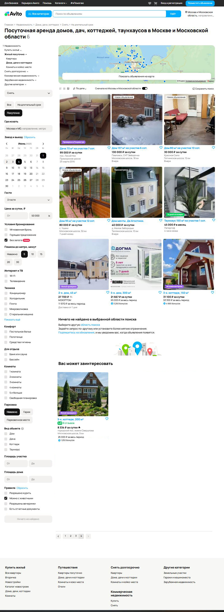

# Задание 1
----------------------------------------------
Формулировка: Перед вами скриншот страницы Авито с результатами поиска. Изучите его, перечислите все имеющиеся баги, и укажите их приоритет (high, medium, low).

[Ответ на это задание здесь!](taskOne/BugReport.md)



# Задание 2.1.
Суть задания:
Составьте тест-кейсы для проверки api этого микросервиса
Оформите решение в файле TESTCASES.md
Автоматизируйте написанные тест-кейсы 

В автоматизированных тест-кейсах нужно проверять результат
Запустите автоматизированные тесты
Все тесты должны быть пройдены
Задание можно выполнить на любом языке программирования, с использованием любого фреймворка или драйвера. Мы рекомендуем использовать один из следующих языков: Go, JavaScript, TypeScript - но при желании вы можете выбрать любой удобный вам стек
Напишите понятную и воспроизводимую инструкцию, оформите инструкцию в файле README.md
Если в результате тестирования найдены баги, то составьте баг-репорт в файле BUGS.md

## Структура проекта
```
taskTwo/
├── imgBUGS/                    # Папка для изображений багов (например, скриншоты ошибок)
├── test/                       # Основные тестовые файлы
│   ├── test_createItem.js          # Тесты для POST /api/1/item
│   ├── test_deleteItem.js          # Тесты для DELETE /api/2/item/:id
│   ├── test_getItemById.js         # Тесты для GET /api/1/item/:id
│   ├── test_getItemsBySeller.js    # Тесты для GET /api/1/:sellerID/item
│   ├── test_getStatisticById.js    # Тесты для GET /statistic/:id
│
├── BUGS.md                    # Описание найденных багов
├── TESTCASES.md               # Подробное описание тест-кейсов
├── helpers.js                 # Вспомогательные функции (например, генерация данных)
└── README.md                  # Инструкция по запуску проекта (вы читаете это)
```
