# Bug Report 

## 1. Карта показывает Санкт-Петербург, а не Москву и Московскую область
Нарушает логику поиска: пользователь ожидает увидеть карту соответствующего региона.

Приоритет: **High**
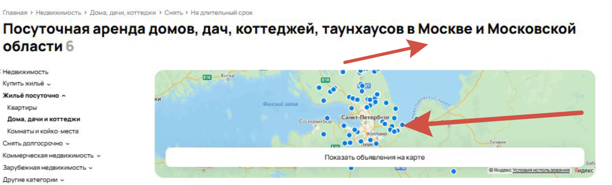

-------------------
 ## 2. Некоректное отображения
 Пользователь выбрал отображение объявлений на карте, но вместо этого система показывает список в виде панели (текстовые карточки объявлений). 
 Это не соответствует ожидаемому поведению интерфейса, может ввести пользователя в заблуждение.
 
 Приоритет: **High**
 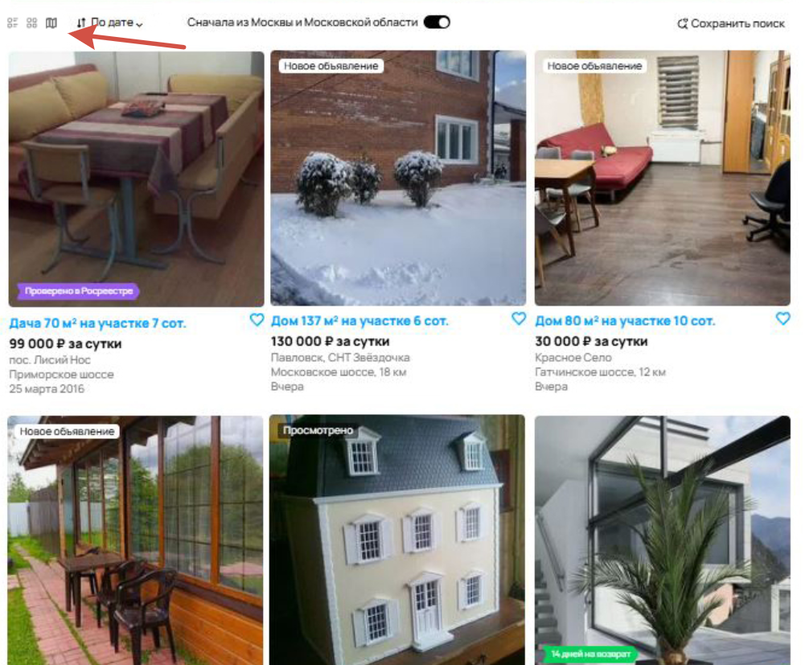

 ## 3. Сортировка по дате
При сортировке объявлений по дате (предполагается, что новые должны быть выше) система некорректно отображает порядок:

- Первым идет объявление от 25 марта 2016 (9 лет назад).
- Ниже — объявления с пометкой "Вчера" (актуальные).
Это противоречит логике сортировки и вводит пользователей в заблуждение.

Приоритет: **High**
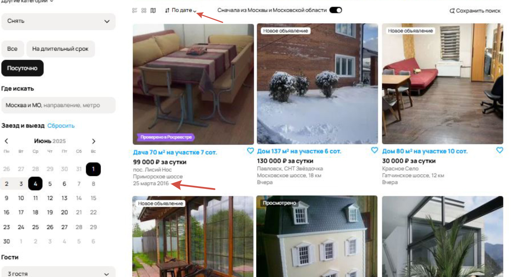

## 4. Фильтр Цена за сутки
Фильтр "Цена за сутки" установлен на максимум 50 000 ₽, но в результатах поиска отображаются объявления с ценой 80 000 ₽, 130 000 ₽.
Это означает, что фильтр не применяется или работает некорректно.

- Нарушает базовую функциональность поиска.
- Вводит пользователей в заблуждение: они ожидают видеть только варианты в выбранном ценовом диапазоне.
- Может привести к потере доверия к сервису (пользователи подумают, что фильтры "фейковые").

Приоритет: **High**
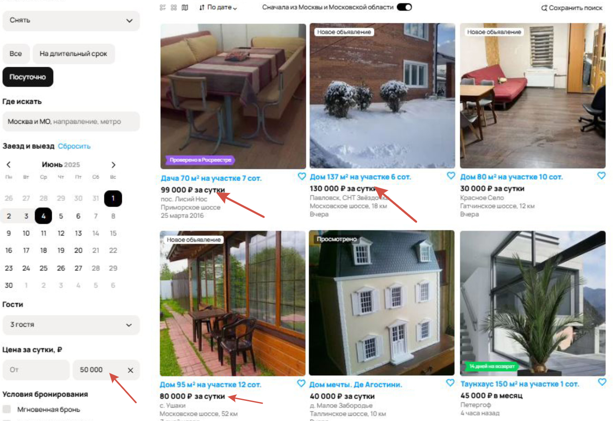

## 5. Несоответствие выбранного фильтра и хлебных крошек
Не критично для функциональности, но сильно путает пользователей.
Может привести к неправильному выбору аренды (например, человек ищет посуточно, но попадает в раздел долгосрочной аренды).

Приоритет: **Medium**

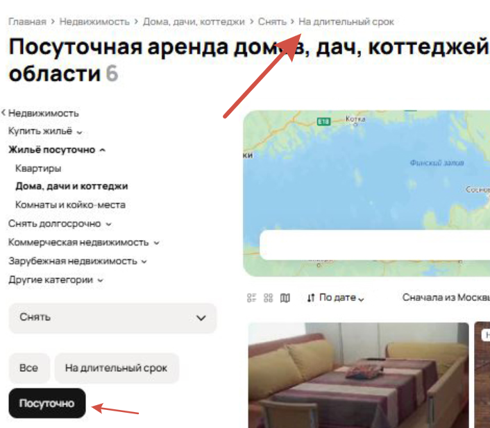

## 6. Противоречивое поведение поиска
Функциональность поиска не сломана, но интерфейс противоречив.
Пользователи могут пропустить актуальные объявления из-за ошибочного сообщения.
Снижает доверие к сервису (ложное "ничего не найдено")

Приоритет: **Medium**
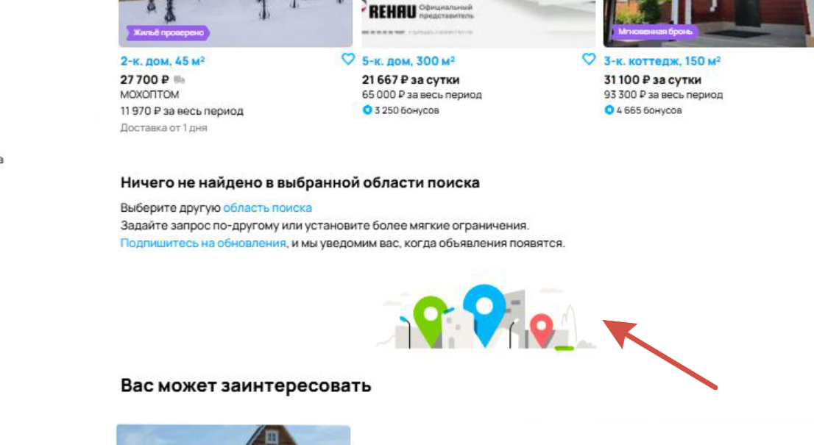

## 7. Некорректное количество обьявлений 

При 6 объявлениях и отображении 9 объявлений на странице.
Поиск работает, но подсчет и отображение результатов противоречивы.

Приоритет: **Medium**
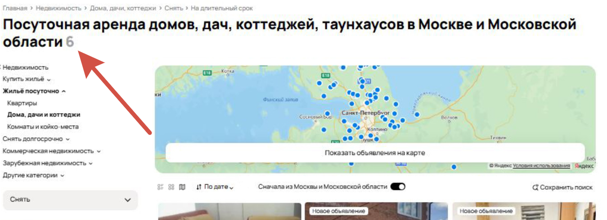

## 8. Некорректное количество страниц (пагинация) 
При отображении по 9 объявлений на странице должно быть не более 1 страницs. 
Однако интерфейс показывает «4 страницы» это неверно, так как еще показывается что общее количество обьявлений 6.

Приоритет: **Medium**
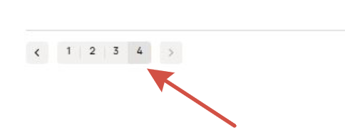

## 9. Некорректная подпись «Найти»
Вместо «Найти» отображается «Найт» (пропущена буква «и»), 
что является опечаткой и портит внешний вид интерфейса.

Приоритет: **Low**

## 10. Некорректная подпись «До»
Вместо «До» отображается «Де» (ошибка в написании через букву «е»), 
что является опечаткой и портит внешний вид интерфейса.

Приоритет: **Low**
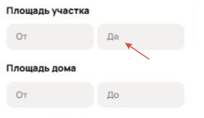

## 11. Некорректная подпись «койко»
Вместо «койко-место» отображается «коко» (пропущена буква «й»), 
что является опечаткой и портит внешний вид интерфейса.

Приоритет: **Low**

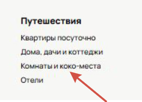

## 12. Некорректное изображение в объявлении
В объявлении изображение не соответствует названию и выбранному фильтру.
Так там изображена услуга по установке окон.
Возможно ошибка была допущена на стадии модерации объявления.

Приоритет: **Low**

## 13. Некорректное изображение в объявлении
В объявлении изображение не соответствует названию и выбранному фильтру.
Так там изображен игрушечный дом.
Возможно ошибка была допущена на стадии модерации объявления.

Приоритет: **Low**
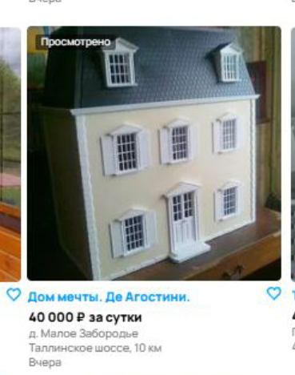

## 14. Наличие доставки на дом в объявлении недвижимости
Вероятно, дублируется блок доставки из других категорий товаров, это может спутать пользователей.

Приоритет: **Low**
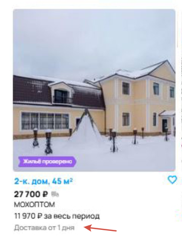

## 15. Некорректные расчёты: цена "за весь период" меньше, чем "за сутки"
Ошибка в ценообразовании или отображении данных, это может запутать пользователей при выборе.

Приоритет: **Medium**
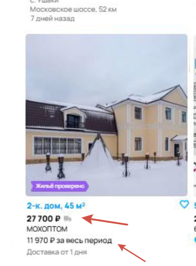

