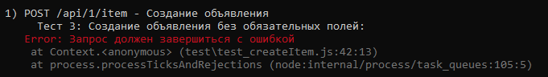
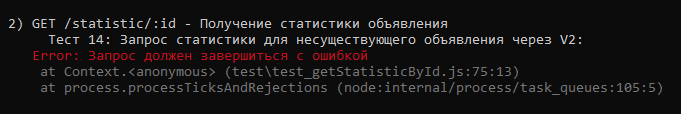
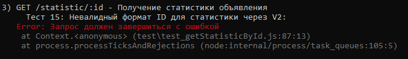

# Bug Report: Создание объявления без обязательных полей

## Bug 1 — Создание объявления без обязательных полей
- Маршрут: POST /api/1/item
- Описание: При попытке создать объявление без обязательных полей (например, без name, price, statistics) сервер не возвращает ожидаемую ошибку.
- Ожидаемое поведение: Сервер должен возвращать ошибку 400 Bad Request.
- Фактическое поведение: Запрос завершается успешно (код 200), несмотря на отсутствие обязательных данных.
- Тест: Тест 3: Создание объявления без обязательных полей

----------------
## Bug 2 — Получение статистики для несуществующего объявления (V2)
Маршрут: GET /statistic/:id (версия V2)
Описание: При запросе статистики для несуществующего объявления, сервер должен возвращать ошибку 404 Not Found.
Ожидаемое поведение: Возврат ошибки 404 с сообщением об отсутствии объявления.
Фактическое поведение: Запрос завершается успешно, несмотря на то, что объявление не существует.
Тест: Тест 14: Запрос статистики для несуществующего объявления через V2

--------------
## Bug 3 — Получение статистики с невалидным ID (V2)
Маршрут: GET /statistic/:id (версия V2)
Описание: При передаче некорректного ID (например, строки, не соответствующей формату UUID), сервер должен возвращать ошибку 400 Bad Request.
Ожидаемое поведение: Возврат ошибки 400 с сообщением о некорректном формате ID.
Фактическое поведение: Запрос завершается без ошибки или приводит к внутренней ошибке сервера (500).
Тест: Тест 15: Невалидный формат ID для статистики через V2

